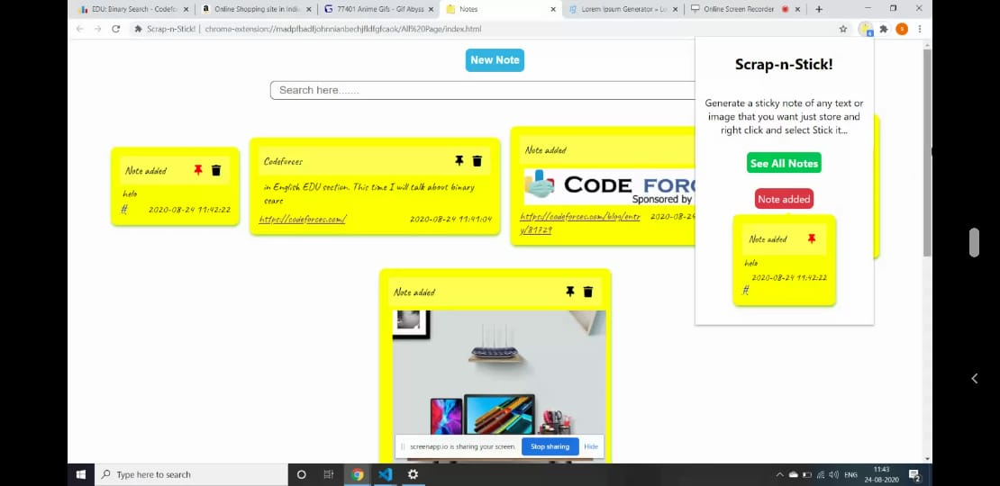

                                           
  ## Scrap-n-Stick
 
  
  
  ### Project by- Pranav Sharma & Sanchit Gupta
  
  
  ### Tech Stack
  * HTML
  * CSS
  * Java Script
  
 ### Description
 This extention aims to ease-up and fasten your browsing and researching experience by helping you create notes of data available on web pages by a single click. 
 The notes are then stored locally which can be viewed when required. Apart from text you can also prepare notes containing images and gifs. 
 The notes store this data along with the page url and a time stamp. This extension also provides you the features to search through your notes, edit the notes,  create your own costum notes and **pin** the notes to the popup window.

 ### Scope of Improvement
 * First of all, the storage provided by the chrome api is limited so we will expand our storage using a database.
 * Improvising the popup interface.  
 We will be looking forward to these changes and some more features in Scran-n-Stick 2.0
 
  
